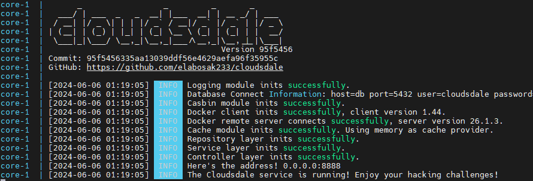

# 快速上手

本篇将教会你如何快速地部署一个 Cloudsdale 实例。这个实例具有以下特点：

- 使用 PostgreSQL 作为数据库
- 使用 Docker 单机实例，承担平台和动态容器后端

部署她的方式非常简单，你只需要准备一个 `docker-compose.yml` 即可，当然，你可以直接从仓库中的 [deploys](https://github.com/ElaBosak233/Cloudsdale/blob/main/deploy) 目录中找到你所需要的，一个简单的 `docker-compose.yml` 应该长这样：

```yaml
version: "3.0"
services:
  core:
    image: elabosak233/cloudsdale:main
    restart: always
    ports:
      - "8888:8888"
    volumes:
      - "/var/run/docker.sock:/var/run/docker.sock" # 映射 Docker 守护进程，使得 Cloudsdale 可以控制宿主机 Docker
      - "./configs:/app/configs" # 映射配置文件夹，里面存放 application.json
      - "./media:/app/media" # 映射媒体资源文件夹，里面存放题目附件、用户头像等
      - "./logs:/app/logs" # 映射日志文件夹
    depends_on:
      - db # 依赖于 db

  db:
    image: postgres:alpine
    restart: always
    ports:
      - "5432:5432"
    environment:
      POSTGRES_USER: cloudsdale
      POSTGRES_PASSWORD: cloudsdale
      POSTGRES_DB: cloudsdale
    volumes:
      - "./db:/var/lib/postgresql/data"
```

你需要在你的服务器上建一个新的空文件夹，然后将 `docker-compose.yml` 放入其中，然后运行：

```
docker compose up
```

第一次运行大概率是失败的，因为 Cloudsdale 默认生成的配置中，依赖的数据库不是 PostgreSQL，我们需要在初始化后进入 `/configs/application.json` 进行些许修改

```json
"db": {
		"provider": "postgres", // 修改这里
		"postgres": {
			"dbname": "cloudsdale",
			"host": "db",
			"username": "cloudsdale",
			"password": "cloudsdale",
			"port": 5432,
			"sslmode": "disable"
		},
		"mysql": {
			"dbname": "cloudsdale",
			"host": "db",
			"username": "cloudsdale",
			"password": "cloudsdale",
			"port": 3306
		},
		"sqlite": {
			"path": "./db/db.sqlite"
		}
	},
```

修改完成后，再运行一遍 `docker compose up`，如果你看到下面这样的输出，那么恭喜你，Cloudsdale 启动的很成功，此后，你可以使用 `docker compose up -d` 将 Cloudsdale 以后台的形式启动



然后，你就可以通过 `http://localhost:8888` 进入 Cloudsdale，端口你可以通过编辑 `docker-compose.yml` 中的 `ports` 进行更改